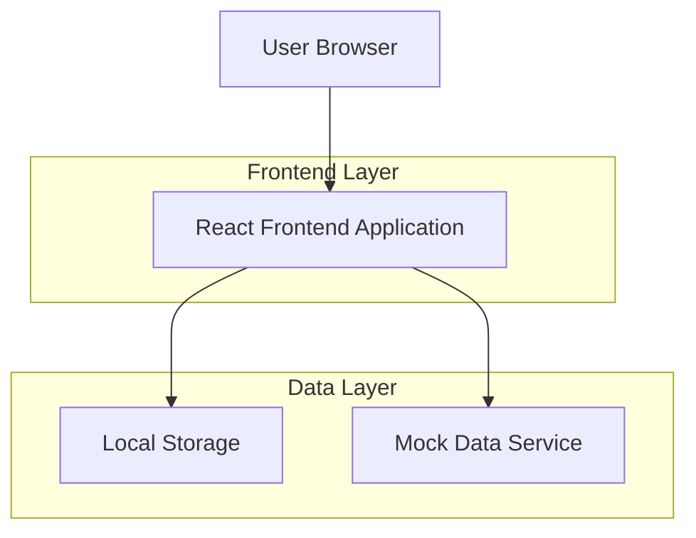
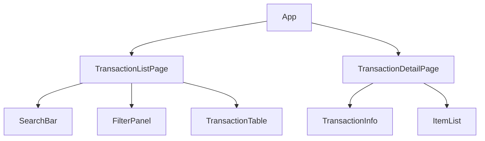

## 1. Architecture design



## 2. Technology Description
- Frontend: React@18 + tailwindcss@3 + vite
- Initialization Tool: vite-init
- Backend: None (frontend-only)
- State Management: React Context API
- Data: Mock JSON data

## 3. Route definitions
| Route | Purpose |
|-------|---------|
| /transactions | Main transaction list page |
| /transactions/:id | Individual transaction details |

## 4. API definitions

### 4.1 Transaction Data Types
```typescript
interface Transaction {
  id: string;
  date: string;
  customerName: string;
  totalAmount: number;
  paymentMethod: 'cash' | 'card' | 'gcash';
  status: 'completed' | 'pending' | 'cancelled';
  items: TransactionItem[];
}

interface TransactionItem {
  id: string;
  name: string;
  quantity: number;
  price: number;
  subtotal: number;
}

interface FilterOptions {
  searchTerm?: string;
  dateFrom?: string;
  dateTo?: string;
  paymentMethod?: string;
  status?: string;
}
```

### 4.2 Mock Data Service
```javascript
// Mock transaction data
const mockTransactions: Transaction[] = [
  {
    id: 'TXN-001',
    date: '2026-01-10',
    customerName: 'Juan Dela Cruz',
    totalAmount: 1250.00,
    paymentMethod: 'cash',
    status: 'completed',
    items: [
      { id: '1', name: 'Coca Cola', quantity: 2, price: 25.00, subtotal: 50.00 },
      { id: '2', name: 'Bread', quantity: 1, price: 35.00, subtotal: 35.00 }
    ]
  }
];

// Filter function
function filterTransactions(filters: FilterOptions): Transaction[] {
  return mockTransactions.filter(transaction => {
    // Implementation ng filtering logic
  });
}
```

## 5. Component Structure


## 6. State Management
- React Context API para sa transaction data
- Local state para sa filters at search
- URL params para sa transaction ID