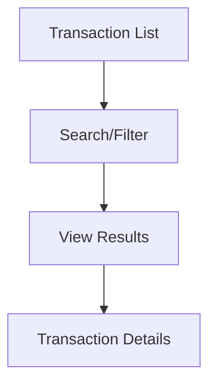

## 1. Product Overview
Module ng Transaction Record para sa POS system. Front-end lang na nagpapakita ng listahan ng mga transaksyon at filtering capabilities.

## 2. Core Features

### 2.1 User Roles
| Role | Registration Method | Core Permissions |
|------|---------------------|------------------|
| Cashier | System account | View transaction records, filter transactions |
| Manager | System account | View all transactions, export data |

### 2.2 Feature Module
Ang transaction module ay binubuo ng mga sumusunod na page:
1. **Transaction List**: Display ng lahat ng transaksyon, search bar, at filter options.
2. **Transaction Details**: Detailed view ng individual transaction.

### 2.3 Page Details
| Page Name | Module Name | Feature description |
|-----------|-------------|---------------------|
| Transaction List | Search Bar | Mag-allow ng search by transaction ID, customer name, o amount. |
| Transaction List | Filter Panel | Filter by date range, payment method, at transaction status. |
| Transaction List | Transaction Table | Display ng transaction ID, date, customer, amount, at status. |
| Transaction List | Pagination | Navigate through multiple pages ng results. |
| Transaction Details | Transaction Info | Show complete details ng transaction. |
| Transaction Details | Item List | Display ng mga items na binili. |

## 3. Core Process
User flow para sa pag-view ng transactions:
1. User pumunta sa Transaction List page
2. Gumamit ng search o filter para hanapin specific transactions
3. Click sa individual transaction para makita ang details

## 4. User Interface Design

### 4.1 Design Style
- Primary color: Blue (#2563eb)
- Secondary color: Gray (#6b7280)
- Button style: Rounded corners with hover effects
- Font: Inter, 14px for body text
- Layout: Table-based with card headers
- Icons: Lucide React icons

### 4.2 Page Design Overview
| Page Name | Module Name | UI Elements |
|-----------|-------------|-------------|
| Transaction List | Search Bar | White background, border radius 8px, placeholder text |
| Transaction List | Filter Panel | Dropdown menus, date pickers, clear filters button |
| Transaction List | Transaction Table | Striped rows, sortable columns, status badges |
| Transaction Details | Transaction Info | Card layout with shadow, two-column format |

### 4.3 Responsiveness
Desktop-first design na adaptive sa mobile. Table becomes horizontally scrollable sa maliit na screens.